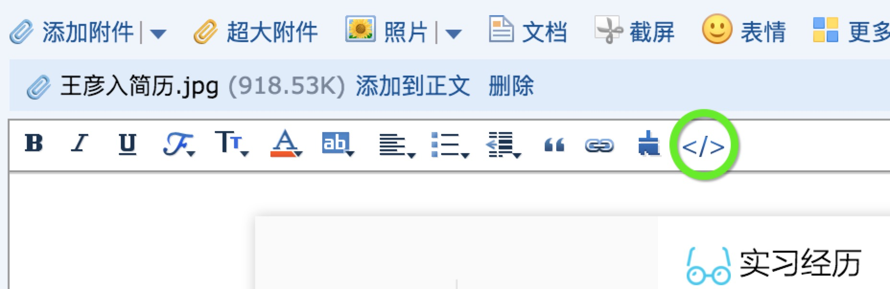
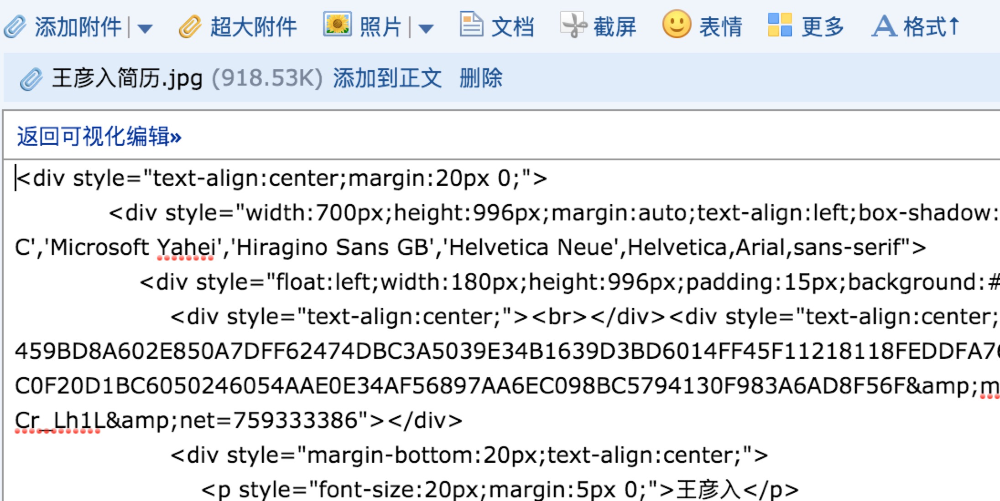
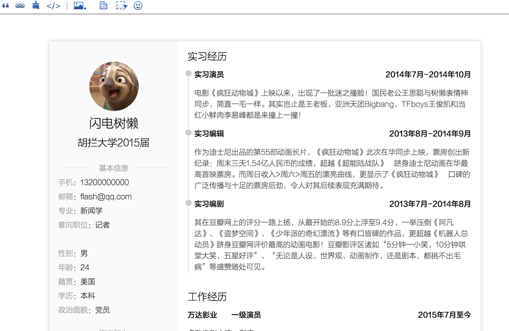
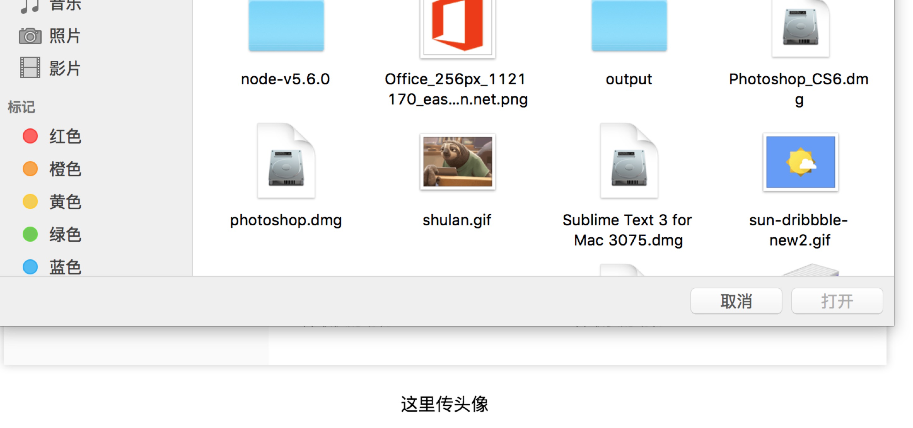
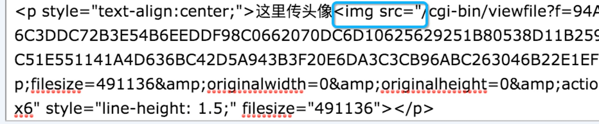
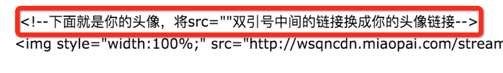

#如何使用
###1、找到代码模式按钮
邮件编辑器的工具栏最后一个按钮就是代码模式，我用的是QQ邮箱，其它的邮箱代码模式按钮应该长得差不多。点击该按钮就可以进入代码模式，如果找不到这个按钮，看看上面一行是否有“格式”按钮，点击它才会显示工具栏。

###2、将代码复制过去
接着代码（点我看代码）复制进去，点击返回可视化编辑就可以看见效果啦。

###3、修改个人信息。
现在你的邮件应该长这个样：

现在你只需要点击相应的信息，改成你自己的就可以啦。现在还有一个问题，就是头像怎么换。为了不破坏现有简历结构，我们到邮件尾部，找个地方上传自己的头像，如下图：

选择自己的头像传上去，接着切换到代码模式，滑到底部，找到形如

把src=””双引号中的内容复制出来，很长哦，但是不用管，复制就行。
找到简历顶部头像的代码，我已经给你标注好了，就在这里：

用刚才复制的内容替换红框下面src=””双引号中的内容，再返回可视化编辑，就可以看见你自己的简历啦。要是简历内容中有链接，你就自己通过编辑器提供的链接工具添加就行啦。
开心地投递简历吧。